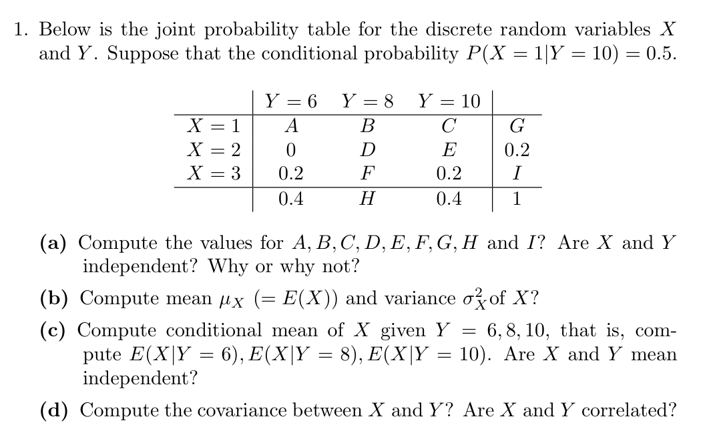
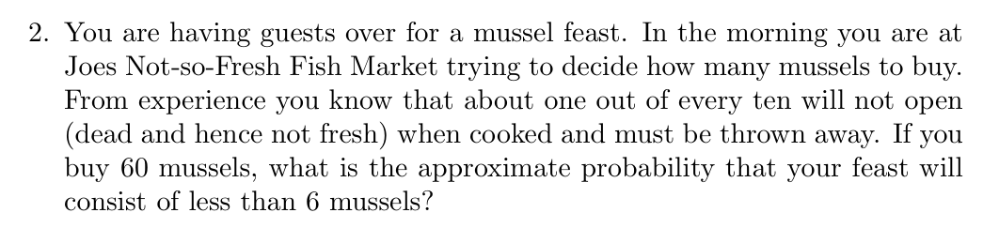
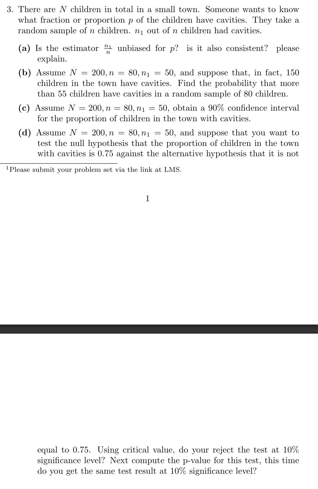

a.
  - `A = 0.2`, `B = 0.0`, `C = 0.2`, `D = 0.2`, `E = 0.0`, `F = 0.0`, `G = 0.4`, `H = 0.2`, `I = 0.4` 
  - X and Y are dependent. A joint probability test shows that `P(X = 1, Y = 6) = 0.2 ≠ P(X = 1) * P(Y = 6)`, `(0.2 ≠ 0.4 * 0.4)`. Therefore, the variables are not independent.

|       | Y = 6 | Y = 8 | Y = 10 |     |
|-------|-------|-------|--------|-----|
| X = 1 |  0.2  |  0.0  |  0.2   | 0.4 |
| X = 2 |  0.0  |  0.2  |  0.0   | 0.2 |
| X = 3 |  0.2  |  0.0  |  0.2   | 0.4 |
|       |  0.4  |  0.2  |  0.4   | 1.0 |

b.
  - `E(X)` = `1 * 0.4 + 2 * 0.2 + 3 * 0.4 = 0.4 + 0.4 + 1.2 = 2`
  - `Var(X)` = `E(X^2) - E(X)^2 = 0.8`
    - `E(X^2)` = `1^2 * 0.4 + 2^2 * 0.2 + 3^2 * 0.4 = 0.4 + 0.8 + 3.6 = 4.8`
    - `E(X)^2` = `2^2 = 4`

c.
  - `Y = 6, E(X) = (1 * 0.2 + 2 * 0.0 + 3 * 0.2) / 0.4 = (0.2 + 0.6) / 0.4 = 2`
  - `Y = 8, E(X) = (1 * 0.0 + 2 * 0.2 + 3 * 0.0) / 0.2 = 0.4 / 0.2 = 2`
  - `Y = 10, E(X) = (1 * 0.2 + 2 * 0.0 + 3 * 0.2) / 0.4 = (0.2 + 0.6) / 0.4 = 2`
  - The conditional mean, `E(X | Y = y)`, is the same as the unconditional mean, `E(X)`. Therefore X is mean independent of Y
  - `E(Y) = (6 * 0.4) + (8 * 0.2) + (10 * 0.4) = 2.4 + 1.6 + 4 = 8`
  - `E(Y | X = 1) = (6 * 0.2 + 8 * 0.0 + 10 * 0.2) / 0.4 = (1.2 + 2) / 0.4 = 8`
  - `E(Y | X = 2) = (6 * 0.0 + 8 * 0.2 + 10 * 0.0) / 0.2 = 1.6 / 0.2 = 8`
  - `E(Y | X = 3) = (6 * 0.2 + 8 * 0.0 + 10 * 0.2) / 0.4 = (1.2 + 2) / 0.4 = 8`
  - The conditional mean, E(Y | X = x), is the same as the unconditional mean, E(Y). Therefore Y is mean independent of X
  - X and Y are mean independent.

d.
  - Cov(X, Y) = `E(XY) - E(X)E(Y) = 16 - 16 = 0`
  - `E(XY) =(1 * 6 * 0.2) + (3 * 6 * 0.2) + (2 * 8 * 0.2) + (1 * 10 * 0.2) + (3 * 10 * 0.2) = 1.2 + 3.6 + 3.2 + 2 + 6 = 16`
  - `E(X) = 2, E(Y) = 8`
  - X and Y are not correlated (since correlation is scaled from covariance)

`P(X < 6) = P(X = 0) + P(X = 1) + P(X = 2) + P(X = 3) + P(X = 4) + P(X = 5)`

`P(X = 0) = C(60, 0) * (1/10)^60`

`P(X = 1) = C(60, 1) * (1/10)^59 * (9/10)^1`

`P(X = 2) = C(60, 2) * (1/10)^58 * (9/10)^2`

`P(X = 3) = C(60, 3) * (1/10)^57 * (9/10)^3`

`P(X = 4) = C(60, 4) * (1/10)^56 * (9/10)^4`

`P(X = 5) = C(60, 5) * (1/10)^55 * (9/10)^5`

a. 
  - 