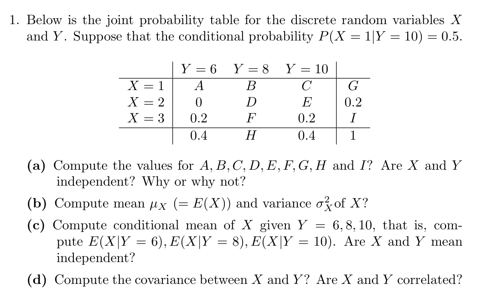
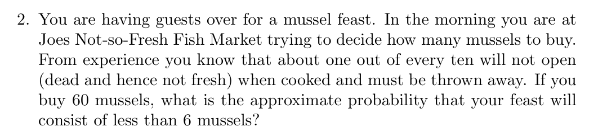
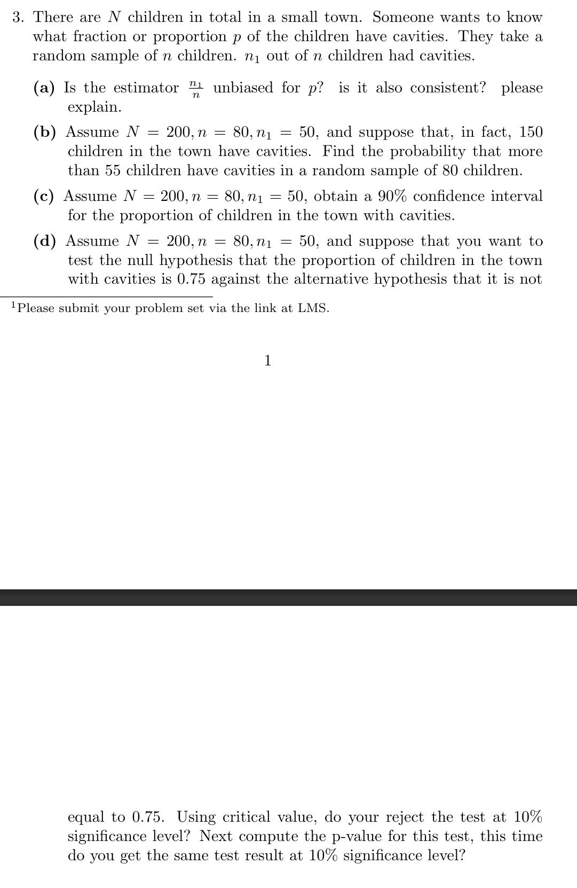

a.
  - `A = 0.2`, `B = 0.0`, `C = 0.2`, `D = 0.2`, `E = 0.0`, `F = 0.0`, `G = 0.4`, `H = 0.2`, `I = 0.4` 
  - X and Y are dependent. A joint probability test shows that `P(X = 1, Y = 6) = 0.2 ≠ P(X = 1) * P(Y = 6)`, `(0.2 ≠ 0.4 * 0.4)`. Therefore, the variables are not independent.

|       | Y = 6 | Y = 8 | Y = 10 |     |
|-------|-------|-------|--------|-----|
| X = 1 |  0.2  |  0.0  |  0.2   | 0.4 |
| X = 2 |  0.0  |  0.2  |  0.0   | 0.2 |
| X = 3 |  0.2  |  0.0  |  0.2   | 0.4 |
|       |  0.4  |  0.2  |  0.4   | 1.0 |

b.
  - `E(X)` = `1 * 0.4 + 2 * 0.2 + 3 * 0.4 = 0.4 + 0.4 + 1.2 = 2`
  - `Var(X)` = `E(X^2) - E(X)^2 = 0.8`
    - `E(X^2)` = `1^2 * 0.4 + 2^2 * 0.2 + 3^2 * 0.4 = 0.4 + 0.8 + 3.6 = 4.8`
    - `E(X)^2` = `2^2 = 4`

c.
  - `Y = 6, E(X) = (1 * 0.2 + 2 * 0.0 + 3 * 0.2) / 0.4 = (0.2 + 0.6) / 0.4 = 2`
  - `Y = 8, E(X) = (1 * 0.0 + 2 * 0.2 + 3 * 0.0) / 0.2 = 0.4 / 0.2 = 2`
  - `Y = 10, E(X) = (1 * 0.2 + 2 * 0.0 + 3 * 0.2) / 0.4 = (0.2 + 0.6) / 0.4 = 2`
  - The conditional mean, `E(X | Y = y)`, is the same as the unconditional mean, `E(X)`. Therefore X is mean independent of Y
  - `E(Y) = (6 * 0.4) + (8 * 0.2) + (10 * 0.4) = 2.4 + 1.6 + 4 = 8`
  - `E(Y | X = 1) = (6 * 0.2 + 8 * 0.0 + 10 * 0.2) / 0.4 = (1.2 + 2) / 0.4 = 8`
  - `E(Y | X = 2) = (6 * 0.0 + 8 * 0.2 + 10 * 0.0) / 0.2 = 1.6 / 0.2 = 8`
  - `E(Y | X = 3) = (6 * 0.2 + 8 * 0.0 + 10 * 0.2) / 0.4 = (1.2 + 2) / 0.4 = 8`
  - The conditional mean, E(Y | X = x), is the same as the unconditional mean, E(Y). Therefore Y is mean independent of X
  - X and Y are mean independent.

d.
  - Cov(X, Y) = `E(XY) - E(X)E(Y) = 16 - 16 = 0`
  - `E(XY) =(1 * 6 * 0.2) + (3 * 6 * 0.2) + (2 * 8 * 0.2) + (1 * 10 * 0.2) + (3 * 10 * 0.2) = 1.2 + 3.6 + 3.2 + 2 + 6 = 16`
  - `E(X) = 2, E(Y) = 8`
  - X and Y are not correlated (since correlation is scaled from covariance)

`P(X < 6) = P(X = 0) + P(X = 1) + P(X = 2) + P(X = 3) + P(X = 4) + P(X = 5)`

`P(X = 0) = C(60, 0) * (1/10)^60`

`P(X = 1) = C(60, 1) * (1/10)^59 * (9/10)^1`

`P(X = 2) = C(60, 2) * (1/10)^58 * (9/10)^2`

`P(X = 3) = C(60, 3) * (1/10)^57 * (9/10)^3`

`P(X = 4) = C(60, 4) * (1/10)^56 * (9/10)^4`

`P(X = 5) = C(60, 5) * (1/10)^55 * (9/10)^5`

a. 
  - Yes, it is unbiased. If the true proportion of kids with cavaties is p, and we randomly sample n kids, we would expect to find `p * n` kids with cavaties. That means `E[n_1] = p * n`, where n_1 is the number of kids with cavities. For our estimator p^, we have `E[p^] = E[n_1/n] = E[n_1] / n = p * n / n = p`. Therefore, p^ is unbiased.
  - The estimator is also consistent. This means that as the sample size n gets larger, the estimate should also get closer and closer to the true proportion value. We can verify this by checking if the variance of the estimator shrinks to zero as the sample size grows to infinity. The variance of the estimator is `Var(p^) = p(1 - p) / n`. As n grows to infinity, the variance converges to 0. This shows that the estimator is consistent.

b. 
  - Assuming a normal distribution , we can use the normal approximation to find the probability (as manually calculating P(X > 55) for a large sample is impractical).
  - For a hypergeometric distribution, the mean is `n * (K/N)`, and the variance is `n * (K/N) * (1 - K/N) * ((N-n)/(N-1))`.
    - mean = `80 * (150 / 200) = 60`
    - variance = `80 * (150 / 200) * (1 - 150 / 200) * ((200 - 80) / (200 - 1)) = 9.045`
    - standard deviation = `sqrt(9.045) = 3.0075`
  - Because this is a continuous distribution, a continuity correction needs to be applied. `P(X > 55)` becomes `P(X > 55.5)`.
  - Z = (x - mean) / standard deviation = (55.5 - 60) / 3.0075 = -1.496
  - P(Z > -1.496) = 1 - P(Z < -1.496) = 1 - 0.0673 = 0.9327
  - The probability that more than 55 children in the sample have cavities is approximately 93.27%

c.
  - Confidence Interval = Sample proportion ± Margin of Error = `0.625 ± 0.0691 = [0.556, 0.694]`
    - Sample Proportion p^ = `50 / 80 = 0.625`
    - Margin of Error = `Z* * Standard Error = 1.645 * 0.042 = 0.0691`
      - Z* = 1.645 for standard 90% confidence interval
      - Standard Error (with finite population correction) = `sqrt(p^(1-p^)/n) * sqrt((N-n)/(N-1)) = sqrt(0.625 * 0.375 / 80) * sqrt((200 - 80) / 199) = 0.042`
  - The confidence interval is `[0.556, 0.694]` for the proportion of children with cavities at 90% confidence level.
  
d.
  - H0: `p = 0.75`
  - H1: `p ≠ 0.75`
  - Significance Level: `a = 0.10`
  - Critical value method: 
    - Standard Error (with finite population correction) = `sqrt(0.75 * 0.25 / 80) * sqrt((200 - 80) / 199) = 0.0376`
    - Z-test statistic = `(p^ - p0) / SE = (0.625 - 0.75) / 0.0376 = -3.32`
    - Critical value = `±1.645` (for two-tailed test at 10% significance level)
    - Since `Z = -3.32` is less than the critical value `-1.645`, it falls in the rejection region. We reject the null hypothesis.
  - P-value method:
    - Z-test statistic = -3.32
    - p-value = `P(Z <= -3.32) + P(Z >= 3.32) = 2 * P(Z <= -3.32) = 2 * 0.00045 = 0.0009`
    - Since `p-value = 0.0009` is less than the significance level `0.10`, we reject the null hypothesis.