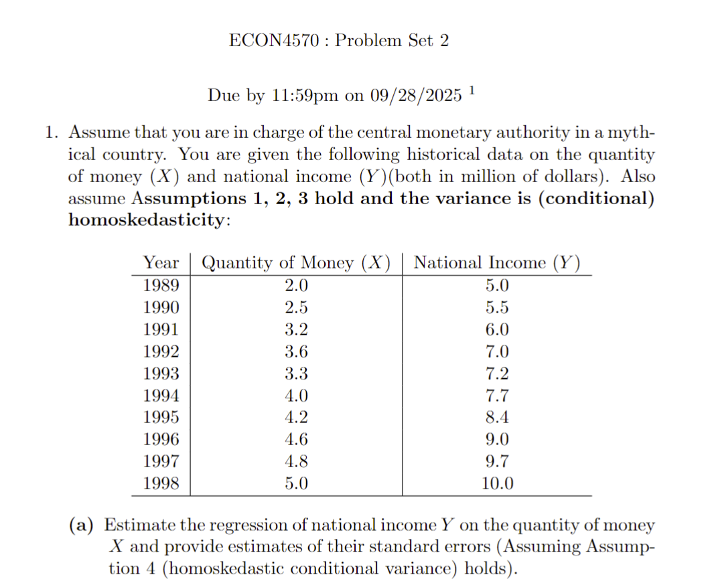
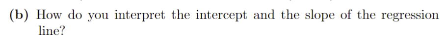
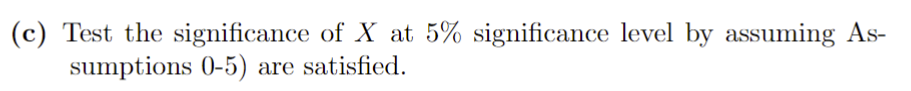
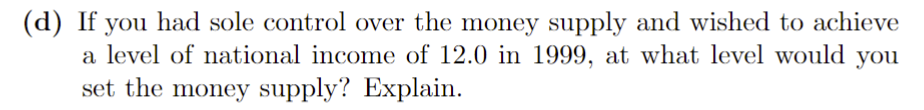
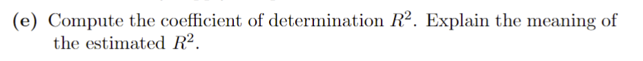
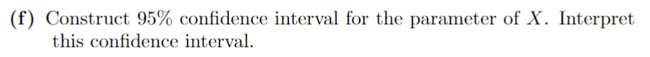

Justin Chen

9/26/2025

ECON-4570 Econometrics

Estimated regression model: $\hat{Y} = \hat{\beta}_0 + \hat{\beta}_1 X$

$\hat{Y} = 1.168 + 1.716X$:
  - $\hat{\beta}_1 = \frac{\sum(X_i - \bar{X})(Y_i - \bar{Y})}{\sum(X_i - \bar{X})^2} \approx 1.716$

    - Mean X $\bar{X} = \frac{1}{n}\sum(X_i)$ = 3.72

    - Mean Y: $\bar{Y} = \frac{1}{n}\sum(Y_i)$ = 7.55

    - Covariance: $\sum(X_i - \bar{X})(Y_i - \bar{Y})$ = 15.09

    - Variance X: $\sum(X_i - \bar{X})^2$ = 8.796

  - $\hat{\beta}_0 = \bar{Y} - \hat{\beta}_1 \bar{X} \approx 1.168$
  - $s.e(\hat{\beta_0}) = \sqrt{\frac{s^2}{n} \frac{\sum{X^2_i}}{\sum{(X_i - \bar{X})^2}}} = 0.483$
    - $s^2 = \frac{1}{n-2}\sum{({Y_i}-\hat{Y_i})^2} \approx 0.1394$
  - $s.e(\hat{\beta_1}) = \sqrt{\frac{s^2}{\sum(X_i-\bar{X})^2}} = 0.126$

The slope of the regression line tells us about the relationship and effect the independent variable X has on the dependent variable Y. For every 1 unit increase in X, Y will be predicted to increase by 1.716.

The intercept tells us that when X = 0, Y is estimated to be at 1.168. For our dataset, it's not realistic that the quantity of money ever is 0 at any point. The intercept in this context is just a mathematical construct to position the regression line correctly.

$H_0: \beta_1 = 0$

$H_1: \beta_1 \not= 0$

$t = \frac{\hat{\beta_1} - \beta_1}{s.e(\hat{\beta_1})} = 13.62$

$df = n - k - 1$ = 8

$\alpha/2 = 0.025$

$t_c = 2.306$

$|t| > t_c \implies |13.62| > 2.306$

Since the calculated t-statistic is larger than the critical value, we reject the null hypothesis that $\beta_1 = 0$. There is strong evidence that Y is correlated and dependent on X.

Using our regression model, we have

$12.0 = 1.168 + 1.716X$

$=>X=6.312$

I would set the money supply (X) at 6.312, although it's important to consider that we do not have any historical data beyond X = 5.0, and thus we are meeely extrapolating.

$R^2=1-\frac{RSS}{TSS}=1-\frac{\sum{e_i^2}}{\sum{(Y_i-\bar{Y})^2}}=1-\frac{(n-2)s^2}{\sum{(Y_i^2)}-n\bar{Y}^2}=0.959$

$CI = \hat{\beta_1} \plusmn (t_c * s.e(\hat{\beta_1})) = 1.716 \plusmn(2.306*0.126)$

$\implies[1.425,2.007]$

This confidence interval means that we are 95% confident that the parameter of X $(\beta_1)$ lies between 1.425 and 2.007. If we repeated the sampling process 100 times, 95 of those processes would be expected to have $\beta_1$ lie between that interval. We are 95% confident that for every 1 unit increase in X, Y will increase by an interval between 1.425 and 2.007.

